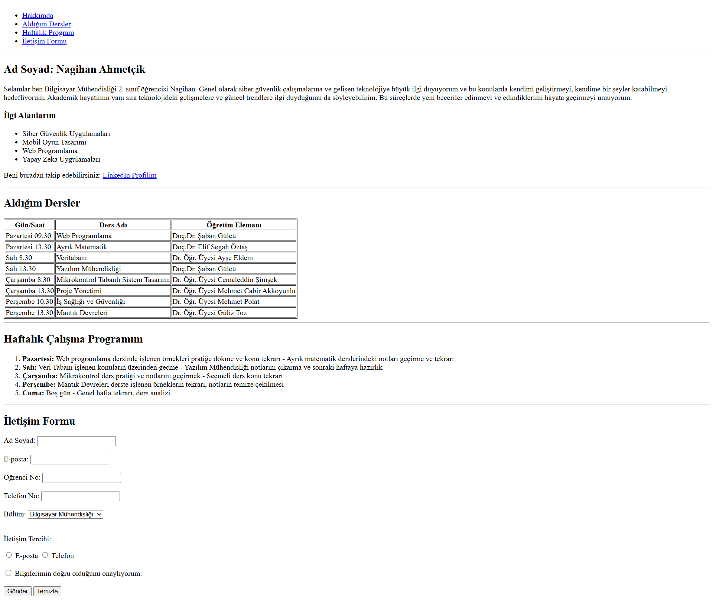

## Simple HTML Portfolio

Bu proje, Web Programlama dersi kapsamında hazırladığım, semantik (anlamsal) HTML etiketleri kullanılarak oluşturulmuş ilk portfolyo çalışmamdır.

## Özellikler
- **Hakkımda Bölümü:** Kişisel bilgiler ve ilgi alanları.
- **Ders Listesi:** HTML Tablo yapısı ile oluşturulmuş dönem dersleri.
- **Haftalık Plan:** Liste yapısı ile günlük çalışma programı.
- **İletişim Formu:** Kullanıcı etkileşimi için tasarlanmış form yapısı.

## Ekran Görüntüsü
Aşağıda projenin tarayıcı üzerindeki tam boyutlu önizlemesi yer almaktadır:

## Kullanılan Teknolojiler
- HTML5 (Semantik etiketler, Tablolar, Formlar)
